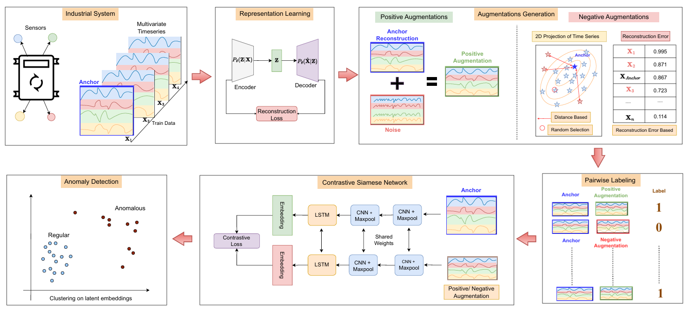

# Self-Supervised-Contrastive-Learning-for-Time-Series-Anomaly-Detection
Source code of the research paper "Self-Supervised Contrastive Learning with Autoencoder Augmentations for Time Series Anomaly Detection". 

This repository contains the implementation of the TRACE (**T**ime series
**R**epresentation learning with **A**utoencoder-based **C**ontrastive **E**mbeddings) framework proposed in the paper.



## Overview
This paper introduces a novel framework for multivariate time series anomaly detection using:
- **Autoencoder-based augmentations** for generating positive and negative samples. 
- **Contrastive learning** via a Siamese network to learn robust embeddings. 
- **Clustering methods** (KMeans, DBSCAN) applied to the learned embeddings for anomaly detection. 


### Key features of the framework:
- **TRACE Framework:** Combines self-supervised contrastive learning with autoencoder-based augmentations to enhance time series anomaly detection (TSAD) by capturing complex temporal patterns.
- **Robust Representations:** Integrates representation learning with contrastive learning, generating more discriminative and robust time series embeddings.
- **Performance:** Evaluated on open-source datasets like SWAT and SMD, as well as a real-world Photovoltaic Inverters Dataset (PID), demonstrating superior performance compared to state-of-the-art TSAD models.
- **Versatility:** Highlights adaptability to other time series tasks and potential for extension to domains beyond time series analysis.

## File Structure

Self-Supervised-Contrastive-Learning-for-Time-Series-Anomaly-Detection
```
│
├── README.md                  # Project documentation
├── TRACE_v6.png               # TRACE Graphical Abstract
│
├── utils/                     # Utility functions
│   ├── aug_utils.py           # Augmentation utilities
│   ├── ae_utils.py            # Autoencoder utilities
│   ├── cl_utils.py            # Contrastive learning utilities
│   ├── cl_functions.py        # Core contrastive learning functions
│   ├── constants.py           # Global constants
│   ├── load_dataset.py        # Dataset loading scripts
│   ├── plots.py               # Visualization scripts
│   └── utils.py               # General helper functions
│
└── Models/                    # Model implementations for SMD Dataset
    ├── SMD_CL_warping.py
    ├── SMD_CL_masking.py
    ├── SMD_CL_permuting.py
    ├── SMD_CL_scaling.py
    ├── SMD_CL_slicing.py
    ├── SMD_CL_timeshifting.py
    ├── SMD_CL_freqshifting.py
    ├── SMD_CL_jittering.py
    ├── SMD_CL_CNNAE.py
    ├── SMD_CL_CNNATTNAE.py
    ├── SMD_CL_LSTMAE.py
    ├── SMD_CL_LSTMATTNAE.py
    ├── SMD_CL_MaskedBiLSTMATTNAE.py
    └── SMD_CL_MultiHeadLSTMATTNAE.py
```

