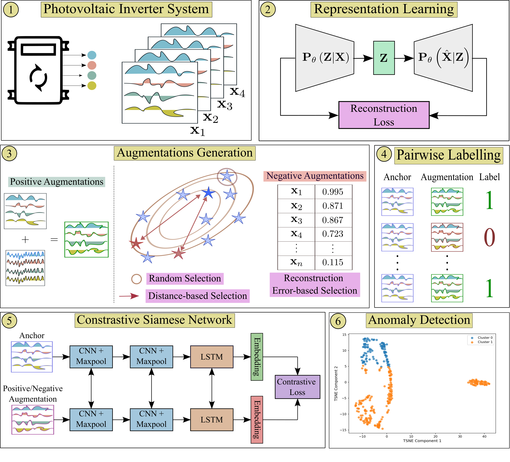

# TRACE: Time Series Representation Learning with Contrastive Embeddings for Anomaly Detection in Photovoltaic Systems
Source code of the research paper "TRACE: Time Series Representation Learning with Contrastive Embeddings for Anomaly Detection in Photovoltaic Systems". 

This repository contains the implementation of the TRACE (**T**ime series
**R**epresentation learning with **A**utoencoder-based **C**ontrastive **E**mbeddings) framework proposed in the paper.



## Overview
This paper introduces a novel framework for multivariate time series anomaly detection using:
- **Autoencoder-based augmentations** for generating positive and negative samples. 
- **Contrastive learning** via a Siamese network to learn robust embeddings. 
- **Clustering methods** (KMeans, DBSCAN) applied to the learned embeddings for anomaly detection. 


### Key features of the framework:
- **TRACE Framework:** Combines self-supervised contrastive learning with autoencoder-based augmentations to enhance time series anomaly detection (TSAD) by capturing complex temporal patterns.
- **Robust Representations:** Integrates representation learning with contrastive learning, generating more discriminative and robust time series embeddings.
- **Performance:** Evaluated on open-source datasets like SWAT and SMD, as well as a real-world Photovoltaic Inverters Dataset (PID), demonstrating superior performance compared to state-of-the-art TSAD models.
- **Versatility:** Highlights adaptability to other time series tasks and potential for extension to domains beyond time series analysis.

## File Structure

Self-Supervised-Contrastive-Learning-for-Time-Series-Anomaly-Detection
```
│
├── README.md                  # Project documentation
├── TRACE.jpg               # TRACE Graphical Abstract
├── requirements.txt         # requirements file
│
├── utils/                     # Utility functions
│   ├── aug_utils.py           # Augmentation utilities
│   ├── ae_utils.py            # Autoencoder utilities
│   ├── cl_utils.py            # Contrastive learning utilities
│   ├── cl_functions.py        # Core contrastive learning functions
│   ├── constants.py           # Global constants
│   ├── load_dataset.py        # Dataset loading scripts
│   ├── plots.py               # Visualization scripts
│   └── utils.py               # General helper functions
│
└── SMD_Models/                    # Model implementations for SMD Dataset
    ├── SMD_CL_warping.py
    ├── SMD_CL_masking.py
    ├── SMD_CL_permuting.py
    ├── SMD_CL_scaling.py
    ├── SMD_CL_slicing.py
    ├── SMD_CL_timeshifting.py
    ├── SMD_CL_freqshifting.py
    ├── SMD_CL_jittering.py
    ├── SMD_CL_CNNAE.py
    ├── SMD_CL_CNNATTNAE.py
    ├── SMD_CL_LSTMAE.py
    ├── SMD_CL_LSTMATTNAE.py
    ├── SMD_CL_MaskedBiLSTMATTNAE.py
    ├── SMD_CL_MultiHeadLSTMATTNAE.py     
    └── SMD_CL_TransformerAE.py 

```

### Installation
### Requirements
- Python 3.8+
- TensorFlow 2.17+
- See requirements.txt for complete list

### Datasets
#### SWaT
- Download: https://itrust.sutd.edu.sg/itrust-labs_datasets/
- Extract to: `data/SWaT/`

#### SMD
- Download: https://github.com/NetManAIOps/OmniAnomaly
- Extract to: `data/SMD/`

#### PID
- Real-world industrial data
- Contact authors for research access

### Augmentation Strategies

TRACE implements two categories of augmentation strategies for contrastive learning:

#### 1. Traditional Time Series Augmentations

These scripts implement classical time series perturbation methods:

- **Warping**: Non-linear temporal distortion
- **Masking**: Random masking of time steps
- **Permuting**: Random permutation of subsequences
- **Scaling**: Multiplicative scaling of amplitudes
- **Slicing**: Random sub-sequence extraction
- **Time Shifting**: Temporal shift of sequences
- **Frequency Shifting**: Spectral domain modifications
- **Jittering**: Additive noise perturbation

#### 2. Autoencoder-Based Augmentations (Primary in TRACE)

These scripts implement semantic augmentations through autoencoder reconstruction perturbations:

- **CNN Autoencoder (CNNAE)**: 1D convolutional encoder-decoder
- **CNN + Attention (CNNATTNAE)**: CNN with self-attention mechanisms
- **LSTM Autoencoder (LSTMAE)**: Bidirectional LSTM encoder-decoder
- **LSTM + Attention (LSTMATTNAE)**: LSTM with attention layers
- **Masked BiLSTM + Attention (MaskedBiLSTMATTNAE)**: Enhanced LSTM variant
- **MultiHead LSTM + Attention (MultiHeadLSTMATTNAE)**: Multi-head attention variant
- **Transformer Autoencoder (TransformerAE)**: Self-attention based architecture ⭐

**Note**: TransformerAE backbone achieves superior performance (21.3% F1 improvement) 
and is the primary backbone used in TRACE framework for PV anomaly detection.

#### Using These Models for Other Datasets

The scripts in the `SMD_Models/` folder were developed for the SMD (Server Machine Dataset) 
and are directly applicable to other time series datasets:

### Benchmark Experiments:
Benchmark comparisons use the MTAD toolkit and CARLA framework to evaluate TRACE under identical settings:

MTAD: Tools and Benchmarks for Multivariate Time Series Anomaly Detection by Liu et al.
[MTAD](https://github.com/OpsPAI/MTAD/tree/main)

CARLA: Self-supervised Contrastive Representation Learning for Time Series Anomaly Detection by Darban et al.
[CARLA](https://github.com/zamanzadeh/CARLA/raw/main/README.md?raw=true)

